---
project:
  output-dir: docs
title: "Introduktion till R"
subtitle: ""
author: "Martin Jonsson, PhD"
institute: "Centrum för hjärtstoppsforskning, KI-SÖS"
format:
  revealjs:
    width: 1500
    height: 1300
    theme: [default, ki_new.scss]
    logo: "ki_new_logo.png"
    css: logo.css
    code-overflow: wrap
    transition: slide
    dev: png
    code-line-numbers: false
    slide-number: c/t
    show-slide-number: all
    code-annotations: hover
editor: visual
warning: false
echo: true
highlight-style: gruvbox
---

## Vem är jag?

Martin Jonsson

Anställd som biträdande lektor på KI-SÖS

Forskar i huvudsak på hjärtstopp utanför sjukhus

## Vilka statistikprogram använder ni?

?

## Hur många har erfarenhet av programmering?

?

## Vad är programering?

- Programering är att ge en dator instruktioner

## Varför använda sig av ett programmeringsspråk?

Finns många anledningar till att kunna ett programmeringsspråk

- Ökar reproducerbarheten avsevärt

  - Du kan inte råka ta bort/ändra värden i ditt dataset

  - Alla steg går att spåra i koden

## Varför använda sig av ett programmeringsspråk?

- Lättare att samarbeta med andra (dela kod)

- Lätt att återanvända kod

- Lätt att "felsöka"

## Varför använda sig av ett programmeringsspråk?

- Tilllåter mer komplexa beräkningar

- Vid en viss datamängd kan man inte längre göra saker "för hand"

  - Tänk en miljon observationer

## Varför använda sig av R?

- Förmodligen det vanligaste programmeringsspråket inom medicinsk forskning.

- Jag har aldrig stött på en statistisk metod som inte finns i något R paket.

## Varför använda sig av R?

- Kan vara lättare att komma igång jämfört med exempelvis Python

## Vad är R?

{fig-align="center" width="129"}

## Vad är R?

- R är ett programmeringsspråk för statistisk analys

- Första version fanns redan 1993

- Bygger på ett äldre programmeringsspråk (S, 1976)

- Utöver base R finns 20,000+ paket ("packages") med förprogrammerade funktioner

## Fördelar med R

- Open source (dvs gratis att ladda ner och använda)

  - Man behöver alltså inte betala för/förnya licenser (vilket lätt blir väldigt dyrt om man inte är anknuten till ett universitet)

- Licenskostnad SPSS;

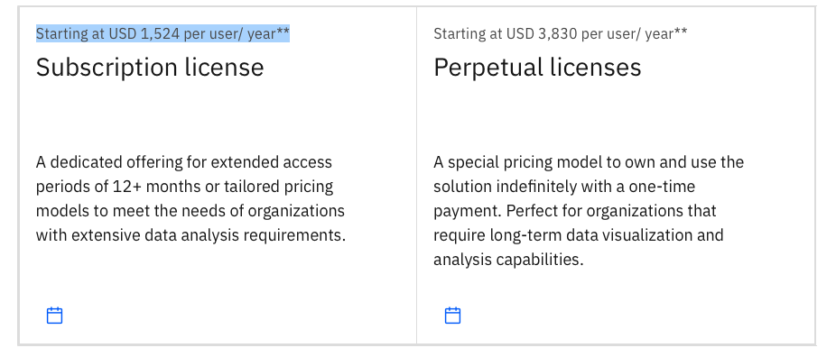

## Fördelar med R

Licenskostnad Stata;

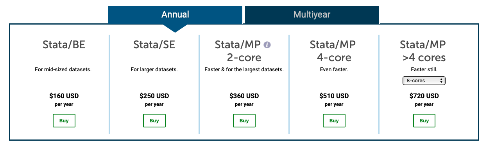

## Fördelar med R

Licenskostnad MATLAB

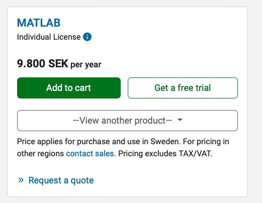

## Fördelar med R

- Mer specialicerat på statistisk analys än andra programmeringspråk

- Väldigt bra då man måste omstrukturera data

## Fördelar med R

- Stor community (Lätt att googla sig fram till svar)

```{r, warning=TRUE, eval=T, error=TRUE}
library(ggplot2)
ggplott(data = iris, aes(x = Sepal.Length, y = Sepal.Width))+
  geom_point()
```

## Claude eller valfri LLM

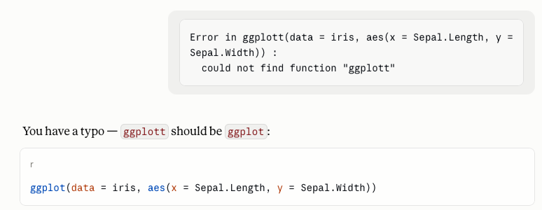

## Google

## 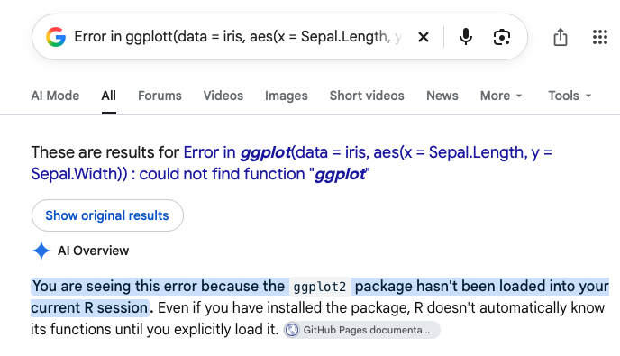{width="719"}

## Nackdelar med R

- Inlärningskurvan kan vara ganska brant

- Kan kännas oöverkomligt om man inte är van vid kod

- Data lagras i datorns minne. Kan ställa till problem om man har stora datafiler.

## Syfte med denna introduktion

- Syftet med denna introduktion är att ge en överblick över R som statistiskt program

- "Ingen" statistik är inblandad

- Övergripande mål är att alla ska känna sig mer bekväma att använda R.

## Ladda ner R

- R laddas ner från <https://cran.r-project.org>

- Hemsidan har sett ungefär likadan ut i 25 år

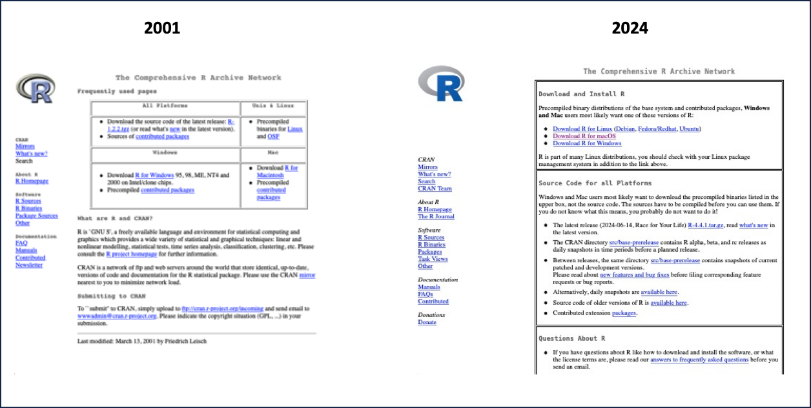{width="872"}

## RTools (Endast för Windows)

Vissa paket kräver att RTools är installerat.

<https://cran.r-project.org/bin/windows/Rtools/>

## 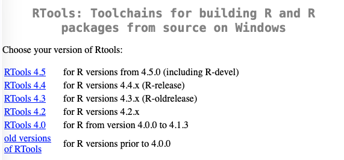{width="800"}

## Då R är installerat

Då R är nedladdat betyder det att din dator kan förstå spårket R

Du kan analysera data med hjälp av terminal (på mac) utan några andra program.

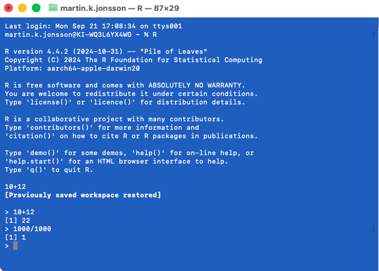

## R GUI

Då man installerat R så ingår ett GUI (graphical user interface)

R GUI har väldigt sparsamt med funktioner.

Rekommenderar inte att använda sig av R GUI

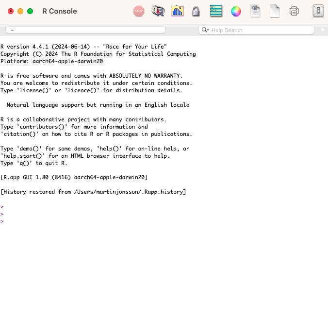

## RStudio

- För att underlätta arbetet i R så finns det en rad IDEs (integrated development environment)

- Det mest populära heter RStudio (<https://posit.co/download/rstudio-desktop/>)

## RStudio

I ett IDE så kan du se olika delar separat

- Source (ditt script/kod)

- Console (resultatet av din kod)

- Environment (Datafiler/objekt du läst in)

- Output (oftast figurer)

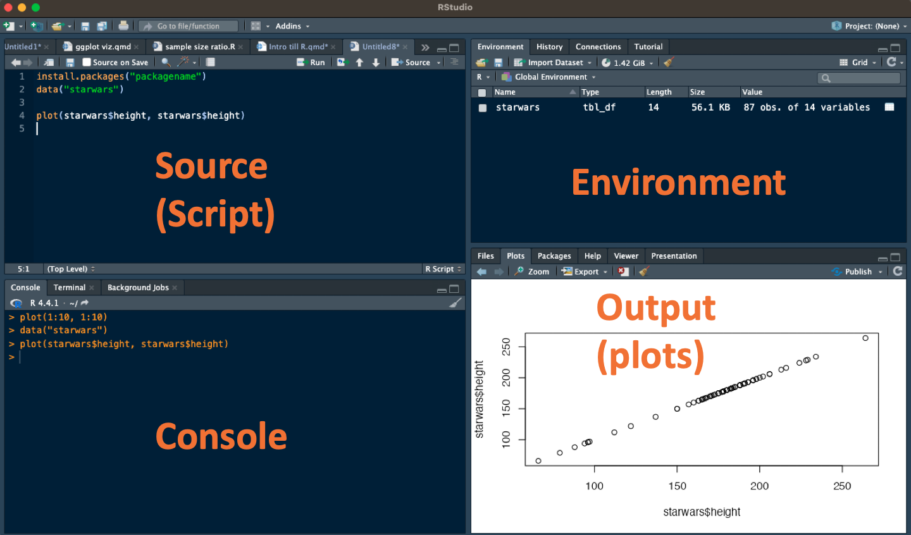{width="683"}

## Rekommendation

- Jag rekommenerar att använda sig av ett IDE likt RStudio

- Det är lättare att arbeta i än R GUI

- Rekommenderar inte point-and-click program (likt jamovi)

# Vad kan man göra i R?

## Vad kan man göra i R?

Förutom att hantera och analysera data så är R väldigt bra för visualisering

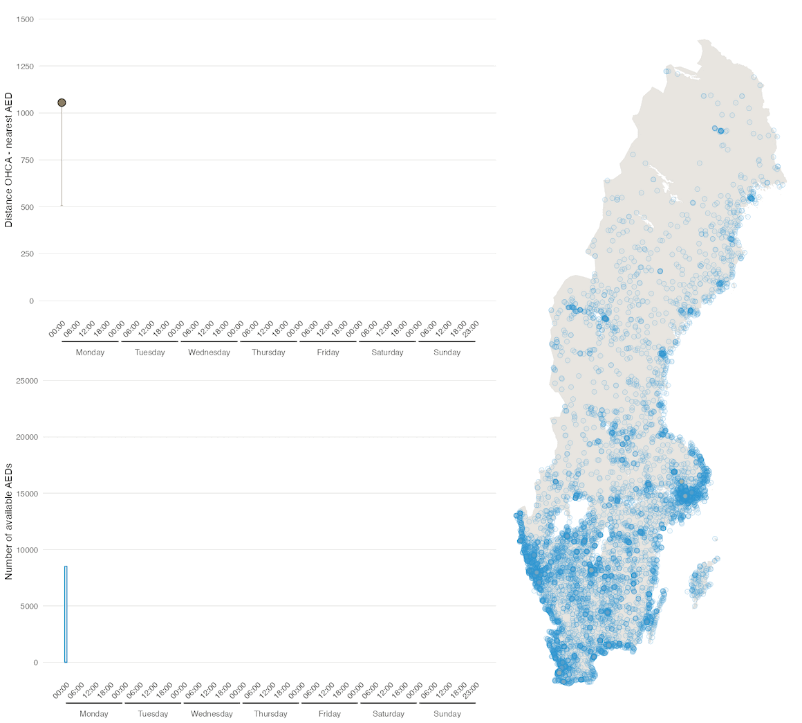

## Skriva kod i R

Det finns olika sätt att skriva kod i R. En vanlig uppdelning är mellan;

- Base R

- tidyverse

Vissa tycker att "tidyverse" är lättare att läsa. Alltid bra att ha förståelse för båda.

Jämförelse av de båda kommer senare

# Base R

{fig-align="center" width="404"}

## Base R

Det som kallas "Base R" är de funktioner och arbetsätt som ingår då man installerar R

## Datatyper i R

Det finns likt de flesta program en rad olika datatyper. De vanligast förekommande är:

- Numeric (Decimaltal)

- Integer (Heltal)

- Character (Text)

- Factor (Kategorier)

- Logical/Boolean (TRUE/FALSE)

## Operatörer

En del saker kan framstå som ologiska till en början

`"=="` betyder inte samma sak som `"="`

`"=="` betyder att du ställer en fråga till R (comparison)

`"="` betyder att du säger åt R att någonting ska vara på ett visst sätt (assignment)

`"="` är mer likt `<-` (mer om detta i kommande slides)

## Exempel

::::: columns
::: {.column width="50%"}
**a = 5**

Första raden i koden nedan säger att objectet `a` ska bestå av bokstaven "A"

Andra raden skriver över objektet `a` med siffran 5

Objektet a är nu samma som siffran 5

```{r}
a <- "A"
a = 5
a
```
:::

::: {.column width="50%"}
**a == 5**

Första raden i koden nedan säger att objectet `a` ska bestå av bokstaven "A"

Andra raden ställer frågan om a==5

Tredje raden ställer frågan om a =="A"

```{r}
a <- "A"
a == 5
a == "A"
```
:::
:::::

## Andra vanliga operatörer

`!` "not"

`!=` "not equal to"

`&` "and"

`|` "or"

`<` "Less than"

`>` "Greater than"

`<=` "Less or equal to"

`>=` "More or equal to"

`~` tilde

## R som miniräknare

::::: columns
::: {.column width="50%"}
R fungerar som en (avancerad) miniräknare.

För att "köra" kod som markerar man den kod man vill köra och trycker på cmd+enter / cntr+enter
:::

::: {.column width="50%"}
```{r}
1+1
2+2/2
(2+2)/2
(2+2)*2
2*2*2
2**3      # samma som ovan   
2^3       # samma som ovan
sqrt(9)   # kvadratrot
x<-20                                   
y<-30
x+y
sum(10,20,30)   # summera
min(10,20,30)   # minsta värdet
max(10,20,30)   # högsta värdet
exp(1)          # basen e=2.72
log10(100)      # 10 logaritmen, 10 som bas
log(100)        # Naturliga logaritmen, e=2.72 som bas

```
:::
:::::

## R som miniräknare

```{r}
sum(10,20,30)                            # summera
min(10,20,30)                            # minsta värdet
max(10,20,30)                            # högsta värdet
mean(c(0, 25, 50, 100, 150))             # medelvärde
sd(c(0, 25, 50, 100, 150))               # standardavvikelse
median(c(0, 25, 50, 100, 150))           # median
quantile(c(0, 25, 50, 100, 150), 0.25)   # Q1
quantile(c(0, 25, 50, 100, 150), 0.75)   # Q3
range(c(0, 25, 50, 100, 150))            # range


```

## Assignment operatör

`"<-"` betyder assignment

`age <- c(28,25,30,40,39,55,62,22,50,35)`

Betyder att jag skapar ett ***objekt*** med 10 observationer, ett ***vektor***

```{r}
age <- c(28,25,30,40,39,55,62,22,50,35)
age

```

## Concatenate `c()`

`c()` betyder att man lägger ihop värden. Koden nedan skapar 3 olika vektor

```{r}
age <- c(28,25,30,40,39,55,62,22,50,35)
sex <- c("F", "F", "M", "M", "F", "F", "F", "M", "M", "F")
hospital <- c("SÖS", "SÖS", "KS", "KS", "KS", "DS", "DS", "SÖS", "DS", "SÖS")

```

## Vektor

Ett **vektor** är en endimensionell datastruktur (tänk datafil med bara 1 variabel)

Datatypen måste vara densamma i ett vektor

```{r}
# Character vector
vector_chr <- c("AB", "BC", "DC", "CD", "BD") 
vector_chr
# Numeric vector 
vector_num <- c(1.1,3.0,5.7,6.9,7.0)
vector_num
#Logical vector
vector_log <- c(T, F, T, F, T)
vector_log
```

## Datatyper kan inte blandas

Om olika datatyper används kommer R tvinga dessa att bli text

```{r}
c("AB", 1, T, "BC", 6.2)
```

## Datafiler (data frames)

En datafil består av flera ihopslagna vektor av samma längd

Koden nedan slår ihop de tidigare objekten `age`, `sex`, och `hospital` till en datafil

```{r}
datafil <- data.frame(age, sex, hospital, row.names = 1:10)

datafil


```

## Var hamnar objekten?

Objekten hamnar i "environment". By default i övre högra hörnet i R Studio.

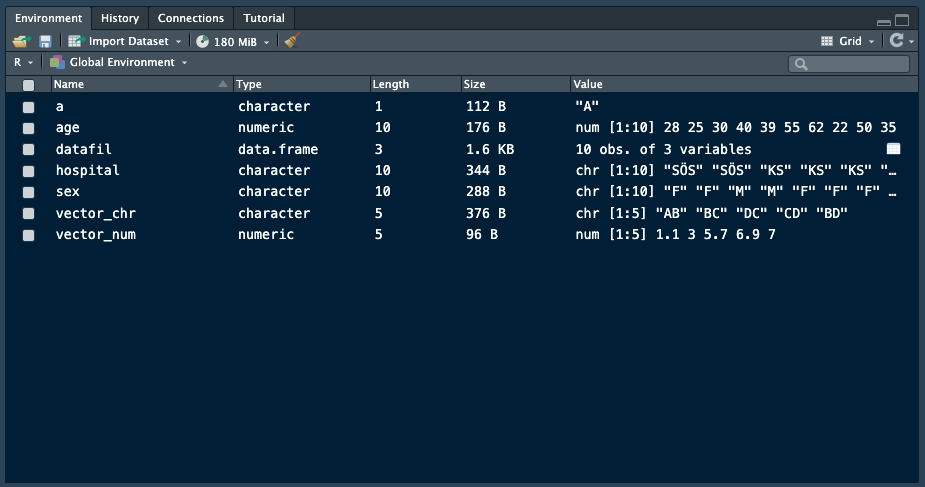

man kan se namnen alla objekt genom att skriva `ls()` (list objects) eller `objects()`.

```{r}
ls()
objects()
```

## Ändra variabeltyp

::::: columns
::: {.column width="50%"}
Variablerna `sex` och `hospital` är av typen "character"

```{r}
str(datafil)
```
:::

::: {.column width="50%"}
Om vi vill ändra det så måste vi instruera R att göra det till factor

```{r}
datafil$sex <- as.factor(datafil$sex)
datafil$hospital <- as.factor(datafil$hospital)

table(datafil$hospital)
```

Som ni ser tolkar R ordningen på faktorer i bokstavsordning
:::
:::::

## Vi kan ändra ordningen genom att specificera `levels`

```{r}
datafil$hospital <- factor(datafil$hospital, 
                           levels=c("SÖS", "DS", "KS"))
table(datafil$hospital)
```

## Struktur på data i R

::::: columns
::: {.column width="70%"}
En datafil i R består av rader och kolumner

`datafil[ radnummer, columnnummer ]`

`datafil[ 3, 2 ]`

Väljer 3e raden och 2e kolumnen
:::

::: {.column width="30%"}
Exempel:

```{r}
#| classes: shrink-code
datafil
# Exempel
datafil[3,2] # <1>


```
:::
:::::

1.  Väljer 3e raden och andra kolumnen

## Datatruktur i R

::::: columns
::: {.column width="50%"}
Specificerar man bara en av dem så väljs alla rader/columner

`datafil[ radnummer,  ]`

`datafil[ , colnummer ]`
:::

::: {.column width="50%"}
Exempel:

```{r}
#| classes: shrink-code
datafil
# Exempel
datafil[3,] # <1>
datafil[,3] # <2>


```
:::
:::::

1.  Väljer 3e raden i datafilen samt alla kolumner
2.  Väljer 3e kolumnen och alla rader

## Välja en variabel

::::: columns
::: {.column width="50%"}
För att välja en variabel i en datafil så skriver man följande

`datafil$variabelnamn`
:::

::: {.column width="50%"}
Exempel:

```{r}
datafil$age


```
:::
:::::

## Funktioner

::::: columns
::: {.column width="50%"}
Funktioner är förprogrammerade beräkningar

`mean(datafil$variabelnamn)`

`median(datafil$variabelnamn)`
:::

::: {.column width="50%"}
Exempel:

```{r}

mean(datafil$age)
median(datafil$age)
quantile(datafil$age, 0.5)


```
:::
:::::

## Funktioner

::::: columns
::: {.column width="50%"}
Funktioner förenklar uträkningar och är det i praktiken man använder hela tiden
:::

::: {.column width="50%"}
Exempel:

```{r}
mean(1:10)
# är samma som
sum(1:10) / length(1:10)
# är samma som
(1+2+3+4+5+6+7+8+9+10) / 10

```
:::
:::::

## Paket (Packages)

En stor styrka i R är att det finns 20000+ paket som man enkelt kan ladda ner.

- För att installera ett paket skriver man `install.packages("package_name")`

  Detta behöver bara göras 1 gång

- För att ladda ett paket så skriver man `library(package_name)`

  (Detta måste göras vid varje ny R session)

Man kan även använda sig av ett installerat paket utan att ladda det

`package_name::funktion()`

## `#`

I R kan man stänga av kod genom att använda sig av `#` (hashtag)

R vet att den inte ska försöka räkna det som kommer

Exempel

```{r}
# Denna kod kommer inte att läsas
# mean(datafil$age)
```

Exempel 2

```{r}
#Jämfört med 
mean(datafil$age)
```

## Good practice

`#` Används för att kommentera kod

Alltid en bra idé att skriva syftet med olika beräkningar

Kan vara knepigt att komma ihåg efter några år

```{r}
# Denna kod väljer ut alla kvinnor i datafilen
datafil[datafil$sex=="F",] 
# Räknar ut medelåldern för kvinnor
mean(datafil$age[datafil$sex=="F"]) 

```

# Tidyverse

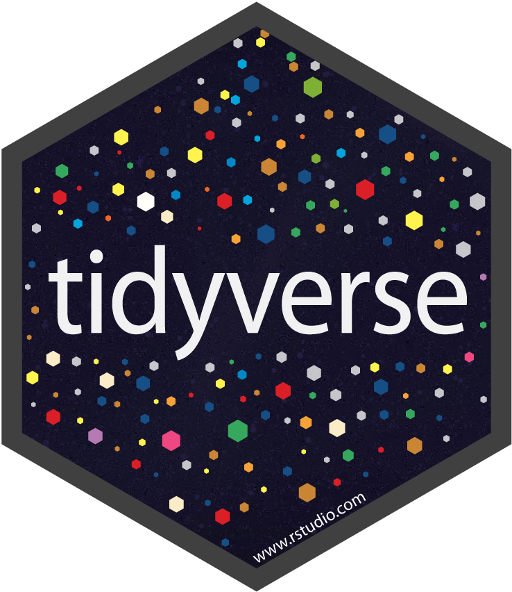{fig-align="center" width="271"}

## Tidyverse

"tidyverse" är en samling av R paket som följer en gemensam filosofi över hur kod skrivs

{width="593"}

## Pipes (`%>%`)

En stor skillnad mellan base R och tidyverse är användandet av `%>%` ("pipes")

Har varit så populärt så att det numera finns i base R men skrivs då `|>`

Man kan utläsa `%>%` som "and then"

## dplyr

Ett mycket användbart paket i R är dplyr vilket används för datamanipulering

dplyr består av en rad "**verb**" och funktioner som underlättar bearbetning av data

`filter()`

`select()`

`arrange()`

`mutate()`

`summarise()`

`group_by()`

## `filter()`

::::: columns
::: {.column width="50%"}
`filter()` används för att välja *rader* i

en datafil utifrån en eller flera variabler
:::

::: {.column width="50%"}
```{r}
library(dplyr)
datafil %>% filter(sex=="F")
datafil %>% filter(hospital=="SÖS")
datafil %>% filter(sex=="F" & hospital=="SÖS")
```
:::
:::::

## `select()`

::::: columns
::: {.column width="50%"}
`select()` används för att välja *kolumner* i en datafil
:::

::: {.column width="50%"}
```{r}

datafil %>% select(sex)
datafil %>% select(hospital)
datafil %>% select(sex, hospital)
```
:::
:::::

## `arrange()`

::::: columns
::: {.column width="50%"}
`arrange()` används för att *sortera* en datafil
:::

::: {.column width="50%"}
```{r}

datafil %>% arrange(age)

datafil %>% arrange(sex, age)

```
:::
:::::

## `mutate()`

::::: columns
::: {.column width="40%"}
`mutate()` används för skapa en ny/koda om en variabel
:::

::: {.column width="60%"}
```{r}

datafil %>% 
  mutate(under40 = ifelse(age<40, "under 40", "över 40"))

```
:::
:::::

## `group_by()`

::::: columns
::: {.column width="50%"}
group_by är egentligen inget verb, men väldigt användbart i kombination med andra verb
:::

::: {.column width="50%"}
```{r}
datafil %>% 
  group_by(hospital) %>% 
  summarise(mean_age = mean(age))
```
:::
:::::

## Kombinera verben

::::: columns
::: {.column width="40%"}
```{r}
datafil %>% 
  filter(sex=="F") %>% 
  select(age) %>% 
  summarise(mean_age = mean(age))
```
:::

::: {.column width="60%"}
Utläses som;

`Utgå från datafil, "och sen"`

`filtrera endast kvinnor, "och sen"`

`välj variabeln "ålder", "och sen"`

`summera "mean_age" genom att räkna ut medelvärdet av ålder`
:::
:::::

# Base R vs tidyverse

::::: columns
::: {.column width="50%"}
{fig-align="center" width="404"}
:::

::: {.column width="50%"}
{fig-align="center" width="271"}
:::
:::::

## Sortera data

::::: columns
::: {.column width="50%"}
Base R

```{r}

datafil[order(sex, age), ]


```
:::

::: {.column width="50%"}
dplyr

```{r}

datafil %>% arrange(sex, age)


```
:::
:::::

## Välja ett subset av data

::::: columns
::: {.column width="50%"}
Base R

```{r}

datafil[which(sex=="F"), ]

datafil[datafil$sex=="F",]

subset(datafil, sex=="F")

```
:::

::: {.column width="50%"}
dplyr

```{r}

datafil %>% filter(sex=="F")


```
:::
:::::

## Skapa ny variabel

Base R

```{r}

datafil$age_cat[datafil$age<=40] <- "0-40"
datafil$age_cat[datafil$age>40 & datafil$age<=60] <- "41-60"
datafil$age_cat[datafil$age>60 & datafil$age<=120] <- "61-120"

datafil

```

```{r, echo=F, include=FALSE}
datafil$age_cat <- NULL
```

dplyr

```{r}

datafil %>% 
  mutate(age_cat = case_when(between(age, 0,40) ~ "0-40",
                             between(age,41,60) ~ "41-60",
                             between(age, 61,120) ~ "61-120"))


```

## Välja enskilda variabler

::::: columns
::: {.column width="50%"}
Base R

```{r}

datafil[, c("sex", "age")]

subset(datafil, select = c(sex, age))

```
:::

::: {.column width="50%"}
dplyr

```{r}

datafil %>% select(sex, age)


```
:::
:::::

## Mer komplexa selekteringar

dplyr är framförallt bra då man måste kombinera olika funktioner

::::: columns
::: {.column width="50%"}
Base R

```{r}

by(datafil[datafil$sex=="F",], 
   INDICES = list(datafil$hospital[datafil$sex=="F"]),
   FUN = function(x){
     data.frame(age.median = median(x$age),
                age.mean = mean(x$age),
                age.sd = sd(x$age))
   })

```
:::

::: {.column width="50%"}
dplyr

```{r}

datafil %>% 
  filter(sex=="F") %>% 
  group_by(hospital) %>% 
  summarise(age.median = median(age),
            age.mean = mean(age),
            age.sd = sd(age))  


```
:::
:::::

## Mer komplexa selekteringar 2

::::: columns
::: {.row .column width="85%"}
Base R

```{r}


aggregate(age ~ hospital, subset(datafil, sex=="F"), FUN=median)
aggregate(age ~ hospital, subset(datafil, sex=="F"), FUN=mean)
aggregate(age ~ hospital, subset(datafil, sex=="F"), FUN=sd)


```
:::

::: {.row .column width="50%"}
dplyr

```{r}

datafil %>% 
  filter(sex=="F") %>% 
  group_by(hospital) %>% 
  summarise(age.median = median(age),
            age.mean = mean(age),
            age.sd = sd(age))


```
:::
:::::

# Arbetsflöde i R

Det första man gör då man öppnar RStudio är att att öppna ett script

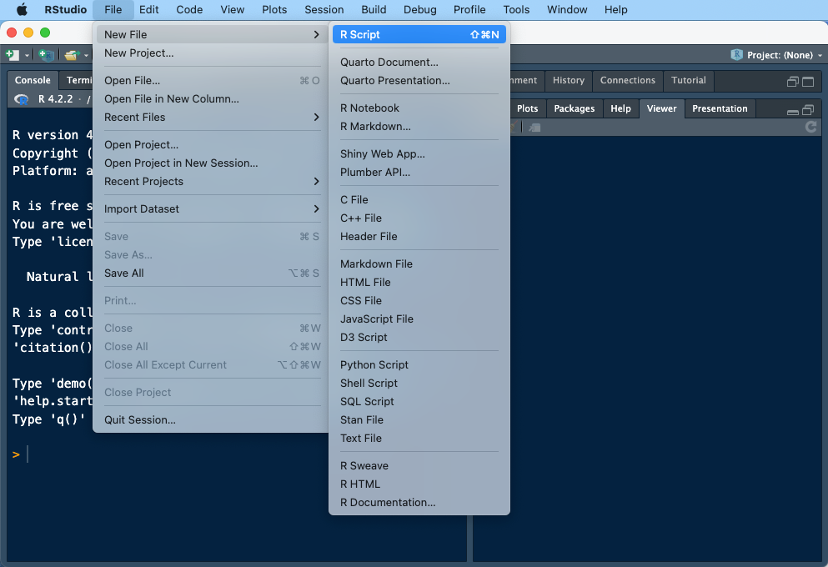

## Installera paket

::::: columns
::: {.column width="50%"}
Innan data kan läsas in så kan man behöva installera vissa paket

Det finns en rad "packages"

- haven (sas, spss, stata)

- readxl (excel)

Vi börjar med att installera och läsa in dessa
:::

::: {.column width="50%"}
```{r, eval=FALSE}
install.packages("haven")
install.packages("readxl")
```

```{r}

library(haven)
library(readxl)
```
:::
:::::

## Läsa in data i R

- För att läsa in data använder man någon funktion

- `read.table()` / `read.csv()` / `readRDS` är inkluderade i R. För dessa behövs inga paket laddas

- För mer avancerade format måste ofta ett annat paket laddas.

```{r, eval=FALSE}
#base R (.csv, .txt)
datafil <-  read.table("~/path/to/file/location/datafil.csv", sep=";")
#base R (.RData)
datafil <-  readRDS("~/path/to/file/location/datafil.rds")
#excel (.xlsx)
datafil <-  readxl::read_excel("~/path/to/file/location/datafil.xlsx")
#stata (.dta)
datafil <-  haven::read_dta("~/path/to/file/location/datafil.dta")
#spss (.sav)
datafil <-  haven::read_spss("~/path/to/file/location/datafil.sav")
#sas (.sas7bdat)
datafil <-  haven::read_sas("~/path/to/file/location/datafil.sas7bdat")
```

## Då data är inläst

::::: columns
::: {.column width="50%"}
Då data är inläst så kan man börjar inspektera data

```{r}

summary(datafil)
str(datafil)
```
:::

::: {.column width="50%"}
```{r}
table(datafil$sex, datafil$hospital)
```
:::
:::::

## Inspektion

Att visualisera data visar ofta om det finns outliers/extrema värden

```{r}
hist(datafil$age, breaks=10)
```

## Finns funktioner som göra inspektering enkel

Paketet skimr kan vara väldigt användbart

```{r}

library(skimr)
skimr::skim(datafil)

```

# Andra datatyper

## Andra datatyper (överkurs)

Utöver vektor och data frames finns det en rad andra datatyper

- `Matrix` (kan ses som en datafil med endast en datatyp, i.e. numerisk/character/logical)

- `List` (Kan exempelvis vara flera olika data frames)

- `Arrays` Liknar matrix men kan innehåller flera dimension

## Skapa egna funktioner (överkurs)

::::: columns
::: {.column width="50%"}
Det är fullt möjligt att skapa funktioner efter behov. Funktionen `mean()` antar till exempel att det inte finns några missing

```{r}
datafil2 <- datafil
datafil2$age[3] <- NA # Kodar om ett värde till NA
mean(datafil2$age)

mean(datafil2$age, na.rm=T)

```
:::

::: {.column width="50%"}
Vi kan skapa en ny mean function där vi specificerar att den bara ska använda värden som finns

```{r}
mean_function <- function(x){
  sum(na.omit(x) / length(na.omit(x)))
}

mean_function(datafil2$age)

```
:::
:::::

# Demonstration

# Arbeta med data

## Data hantering

Det är väldig sällsynt att data kommer i ett format som kan analyseras direkt

Scenario:

Vi har en studie där vi vill "koppla på" data från socialstyrelsen och SCB

Vi har skickat iväg vår data och efter lång väntan har vi fått tillbaka data

## Antal filer

Vanligtvis får man tillbaka en rad datafiler

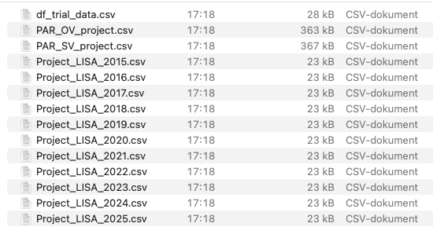

## Tidy data

Målet är att vi ska få ett dataset med 1 rad per observation. Så kallad "tidy data"

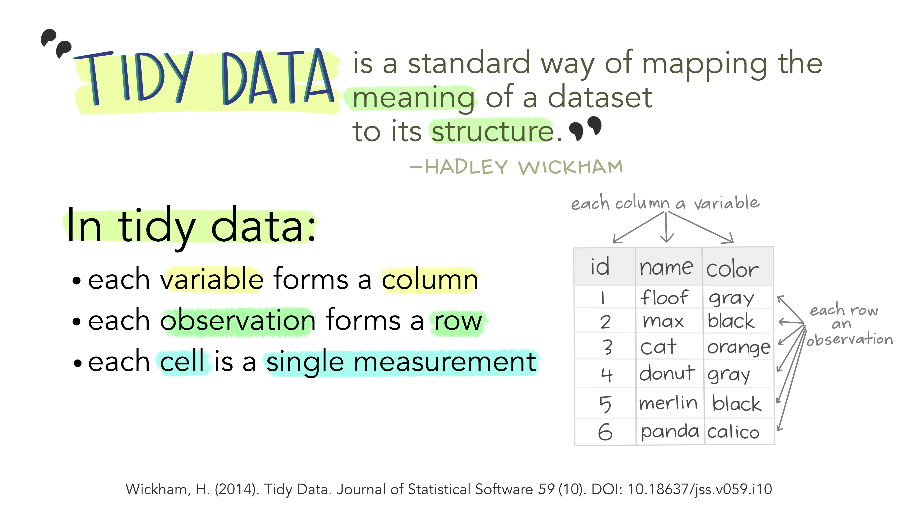

## Den enda filen som är "tidy" är `df_trial_data.csv`

Data är redan i "tidy" format. Dvs en rad per patient och variabler som kolumner.

```{r}
# Sparar url till githubsidan
git_url <- "https://raw.githubusercontent.com/jonssonmartin/forskarskolan-KISOS/main/"

trialdata <- read.csv(
    paste0(git_url, "df_trial_data.csv")
)

head(trialdata)
```

## SCB

Data från SCB kommer alltid i flera filer, oftast 1 fil per år.

Utöver det brukar det vara ett "tidy" format

```{r}
lisa2015 <- read.csv(
    paste0(git_url, "Project_LISA_2015.csv")
)

head(lisa2015)
```

## Problemet ligger i att det är många filer

Detta måste hanteras på något sätt.

Det finns några olika sätt att lösa detta på

## Alternativ 1

Det kan göras genom att läsa in alla filer separat och sedan slå ihop dem

```{r}

lisa2015 <- read.csv(paste0(git_url, "Project_LISA_2015.csv"))
lisa2016 <- read.csv(paste0(git_url, "Project_LISA_2016.csv"))
lisa2017 <- read.csv(paste0(git_url, "Project_LISA_2017.csv"))
lisa2018 <- read.csv(paste0(git_url, "Project_LISA_2018.csv"))
lisa2019 <- read.csv(paste0(git_url, "Project_LISA_2019.csv"))
lisa2020 <- read.csv(paste0(git_url, "Project_LISA_2020.csv"))
lisa2021 <- read.csv(paste0(git_url, "Project_LISA_2021.csv"))
lisa2022 <- read.csv(paste0(git_url, "Project_LISA_2022.csv"))
lisa2023 <- read.csv(paste0(git_url, "Project_LISA_2023.csv"))
lisa2024 <- read.csv(paste0(git_url, "Project_LISA_2024.csv"))
lisa2025 <- read.csv(paste0(git_url, "Project_LISA_2025.csv"))

lisa_df <- dplyr::bind_rows(lisa2015, lisa2016, lisa2017, lisa2018, lisa2019,
                            lisa2020, lisa2021, lisa2022, lisa2023, lisa2024, lisa2025)

skimr::skim(lisa_df)
```

## Datafilen `lisa_df` kan analyseras

Vi har nu en datafil med 11000 observartioner

Vi kan nu ganska enkelt göra om filen till ett tidy format med hjälp av verben vi tidigare gått igenom

```{r}
library(dplyr)
lisa_tidy <- lisa_df |> 
    group_by(LopNr) |> # Gruppera på LopNr
    arrange(Year) |>   # Sortera på Year
    summarise(DispInk04 = mean(DispInk04, na.rm=T),    # räkna ut medelvärdet för DispInk04
              DispInkFam04 = mean(DispInkFam04, na.rm=T), # räkna ut medelvärdet för DispInkFam04
              Sun2000_last = last(Sun2000niva))        # Välj sista värdet på utbildning

head(lisa_tidy) # en rad per patient
```

## Koda om utbildning till mer begripliga kategorier

SUN koderna är svåra att begripa. Vi kodar om dem till kategorier

```{r}
lisa_tidy 
```

## Alternativ 2

Ett annat sätt är att läsa in alla filerna som en lista

```{r}

file_names <- paste0("Project_LISA_", 2015:2025, ".csv")

list_url <- paste0(git_url, file_names)

lisa_list <- lapply(list_url, read.csv)

names(lisa_list) <- 2015:2025
                    

str(lisa_list)
```

## "List of 11"

I den tidigare sliden såg vi att formatet var "list".

Det kan enkelt göras om till en datafil likt exemplet ovan

```{r}

lisa_list_df <- bind_rows(lisa_list)
as_tibble(lisa_list_df)
```

## Listor

I just det här fallet finns en jättestor poäng att använda sig av listor

Men det kan vara bra att använda om man har en stor mängd data, säg en tidsserie på 100 år

```{r}

summary_list <- lapply(lisa_list, function(df) {
    data.frame(
        median_income = median(df$DispInk04, na.rm = TRUE),    
        q1 =   quantile(df$DispInk04, 0.25, na.rm = TRUE),
        q3 =   quantile(df$DispInk04, 0.75, na.rm = TRUE),
        row.names =NULL
    )
})
summary_df <- summary_list |> bind_rows(.id = "Year")
summary_df
```

## Data från patientregistret

Formatet på data från patientregistret är lite annorlunda

```{r}
# Läs in data
PAR_OV <- read.csv(paste0(git_url, "PAR_OV_project.csv"))
PAR_SV <- read.csv(paste0(git_url, "PAR_SV_project.csv"))

#Slå ihop filerna
par <- bind_rows(PAR_SV, PAR_OV)
par <- par %>% 
  group_by(LopNr) %>%  # grupperar på löpnummer
  arrange(LopNr, INDATUM) # soreterar på datum

head(par, n=10)
```

## Ladda paket för datahantering

```{r}
library(tidyr) # wrangling
library(stringr) # arbeta med text
library(purrr)
```

## Tvätta datafilen

För syftet nu så kan vi slå ihop alla diagnosvariabler till en variabel som vi kallar DIAGNOSER

```{r}
## Kodar om alla tomma variabler till NA
par <- par %>% mutate(across(matches("DIA"), ~ na_if(trimws(.), "")))
## Skapar en ny variabel med diagnoser
par <- par %>% 
  unite(DIAGNOSER, matches("DIA"), sep = " ", na.rm = T, remove = TRUE)

head(par)
```

## Räkna ut diagnosvariabler

Följande script kollar ifall en viss diagnoskod förekommer

```{r}

par <- par %>%group_by(LopNr) %>% 
  mutate(I21 = str_detect(DIAGNOSER, "I21"),
         I25 = str_detect(DIAGNOSER, "I25"),
         I10 = str_detect(DIAGNOSER, "I10"),
         diabetes = str_detect(DIAGNOSER, "E10|E11"),
         I48 = str_detect(DIAGNOSER, "I48"))
```

## Kontrollera så det blivit rätt

```{r}

par %>% ungroup() %>% 
  filter(I21==T) %>% 
  select(DIAGNOSER, I21) %>% 
  head() %>% 
  knitr::kable() # används endast för bätter output i presentationen
```

## Vi kan göra samma sak med diabetes

```{r}
par %>% ungroup() %>% 
  filter(diabetes==T) %>% 
  select(DIAGNOSER, diabetes) %>% 
  head() %>% 
  knitr::kable() # används endast för bätter output i presentationen
```

## Utifrån vår datafil så skapar vi nya datafiler för varje diagnos

Akut hjärtinfarkt

```{r}


I21_first <- par %>% 
  filter(I21==T) %>% 
  group_by(LopNr) %>% 
  arrange(LopNr, INDATUM)%>% 
  transmute(I21 = as.numeric(I21) ,I21_date = INDATUM) %>% 
  slice_head(n=1)


```

## Vi gör samma sak för varje diagnoskod

Ischemisk hjärtsjukdom

```{r}
I25_first <- par %>% 
  filter(I25==T) %>% 
  group_by(LopNr) %>% 
  arrange(LopNr, INDATUM)%>% 
  transmute(I25 = as.numeric(I25) ,I25_date = INDATUM) %>% 
  slice_head(n=1)

```

## Hypertension

```{r}

I10_first <- par %>% 
  filter(I10==T) %>% 
  group_by(LopNr) %>% 
  arrange(LopNr, INDATUM)%>% 
  transmute(I10 = as.numeric(I10) ,I10_date = INDATUM) %>% 
  slice_head(n=1)
```

## Diabetes

```{r}
diabetes_first <- par %>% 
  filter(diabetes==T) %>% 
  group_by(LopNr) %>% 
  arrange(LopNr, INDATUM)%>% 
  transmute(diabetes = as.numeric(diabetes) ,diabetes_date = INDATUM) %>% 
  slice_head(n=1)
```

## Förmaksflimmer/fladder

```{r}
I48_first <- par %>% 
  filter(I48==T) %>% 
  group_by(LopNr) %>% 
  arrange(LopNr, INDATUM)%>% 
  transmute(I48 = as.numeric(I48) ,I48_date = INDATUM) %>% 
  slice_head(n=1)
```

## När vi räknat ut alla diagnoser kan vi slå ihop det till en datafil

```{r}
comorb_tidy <- list(I48_first, 
                    diabetes_first, 
                    I10_first, 
                    I25_first, 
                    I21_first) %>% 
  purrr::reduce(full_join, by="LopNr")
```

## Inspektera datafil

Som ni ser så är det 1 unikt LopNr per rad

```{r}
comorb_tidy %>% 
  arrange(LopNr) %>% 
  head(n=20) %>% 
  knitr::kable()
```

## Sista steget är att slå ihop alla datafiler till en

För att göra det så kan i stort sett samma kod återanvändas

```{r}

final_df <- list(trialdata, lisa_tidy, comorb_tidy)%>% 
  purrr::reduce(left_join, by="LopNr")
```

## Inspektera datafil

```{r}
skimr::skim(final_df)
```
